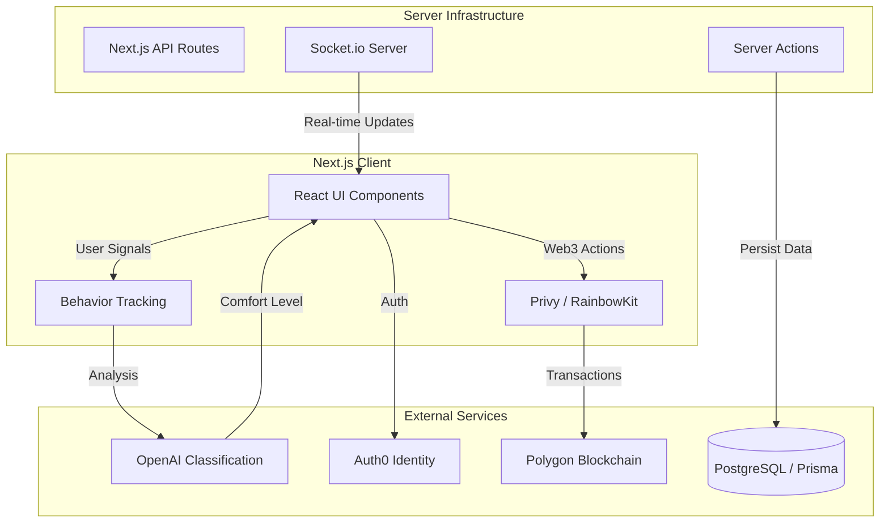
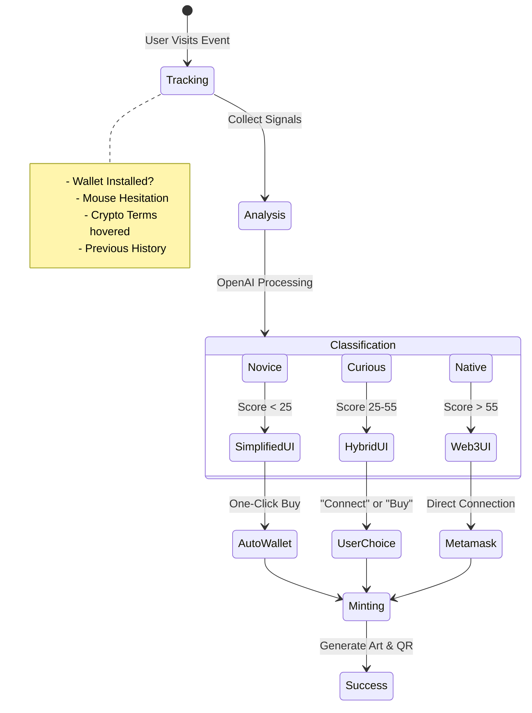

# FanFirst - Fair Ticketing for Real Fans 🎫

An AI-powered NFT ticketing platform built with Next.js that prioritizes real fans over bots and scalpers. **FanFirst** abstracts away the complexity of Web3 while simulating its benefits, providing an adaptive experience for every user.


---

## 🏗️ System Architecture

FanFirst combines a high-performance Next.js frontend with robust blockchain integration and AI layers.



---

## 🧠 AI Adaptive User Flow

The core of FanFirst is its ability to adapt to the user's technical comfort level in real-time.



---

## ✨ Key Features

### 🤖 Adaptive AI Experience
- **Novice:** Sees a "Buy Ticket" button. Wallet is created invisibly in the background.
- **Curious:** Sees both options. AI Assistant offers guided help bubbles.
- **Native:** Sees full Web3 details (Hash, Gas, Wallet Connect).

### 🎨 Generative Ticket Art
Each ticket is a unique NFT visually generated based on the owner's wallet address.
- **Unique Gradient:** No two tickets look exactly alike.
- **Anti-Screenshot:** Dynamic elements verify authenticity.

### 🛡️ Anti-Bot & Scalper Protection
- **Behavioral Analysis:** AI detects non-human click patterns.
- **Resale Caps:** Smart contracts enforce maximum resale prices.
- **Royalties:** Artists get paid on every secondary sale.

---

## 🛠️ Tech Stack

| Category | Technology | Purpose |
|----------|------------|---------|
| **Frontend** | Next.js 16, React | High-performance UI |
| **Styling** | Tailwind CSS 4, Framer Motion | Modern, animated aesthetics |
| **AI** | OpenAI API | Real-time user behavior classification |
| **Blockchain** | Polygon Amoy, Ethers.js | Low-cost NFT minting |
| **Wallets** | Privy, RainbowKit | Embedded & external wallet support |
| **Backend** | Node.js, Socket.io | Real-time events & updates |
| **Database** | PostgreSQL, Prisma | User data & indexing |

---

## 🚀 Getting Started

### Prerequisites
- Node.js 18+
- PostgreSQL database
- OpenAI API Key
- Auth0 Account

### Installation

```bash
# 1. Clone & Install
git clone https://github.com/your-repo/fanfirst.git
npm install

# 2. Environment Setup
cp .env.example .env.local
# (Fill in DB, Auth0, OpenAI, and Alchemy keys)

# 3. Database
npx prisma generate
npx prisma db push

# 4. Run Development
npm run dev:all
```

---

## 🔐 Environment Variables

Ensure your `.env.local` is populated:

```env
# Core
DATABASE_URL="postgresql://..."
AUTH0_SECRET="long_random_string"
AUTH0_BASE_URL="http://localhost:3000"

# Blockchain
NEXT_PUBLIC_POLYGON_RPC_URL="https://polygon-amoy.g.alchemy.com/..."

# AI & Features
OPENAI_API_KEY="sk-..."
NEXT_PUBLIC_PRIVY_APP_ID="clp..."
```

---

## 🤝 Contributing

We welcome contributions! Please fork the repo and submit a PR.
1. Fork it
2. Create your feature branch (`git checkout -b feature/NewFeature`)
3. Commit your changes (`git commit -m 'Add NewFeature'`)
4. Push to the branch (`git push origin feature/NewFeature`)
5. Open a Pull Request

---

## 📄 License
MIT License. Built with ❤️ for the fans.
